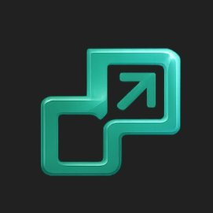

# DokaAI

### AI-powered workflow and execution infrastructure

*Business intent becomes safe execution.*

---

## What is DokaAI?

DokaAI is building a modular execution and orchestration layer for modern software systems.

We help teams manage workflows, communication, automation, and operational execution across services and channels without tightly coupling business logic directly into infrastructure.

---

## Platform Focus

- Unified notification orchestration
- Email, SMS, WhatsApp, push, and in-app delivery
- Delay, digest, and scheduled workflows
- Event-driven execution pipelines
- BYO provider integrations
- Preference-aware routing
- Auditability and operational visibility

---

## Engineering Principles

- Domain-driven architecture
- Event-driven systems
- Explicit service boundaries
- Queue-first execution
- Observable infrastructure
- Modular platform design
- Zero unnecessary data egress

---

## Technology Stack

TypeScript • Node.js • PostgreSQL • Redis • BullMQ

---

## Status

DokaAI is currently under active development and platform restructuring.

Most core repositories remain private while foundational systems continue evolving.

Public SDKs, examples, and developer tooling will gradually become available.

---

### Building infrastructure for scalable business execution.

